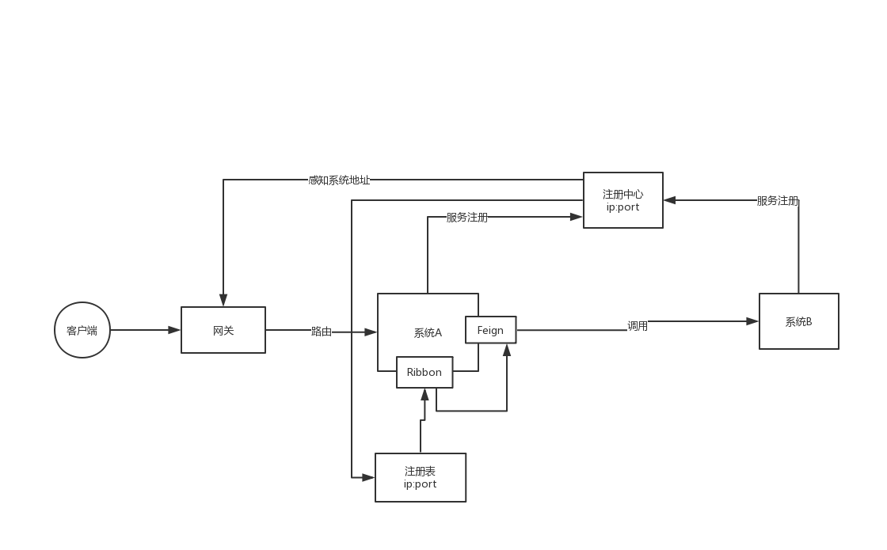
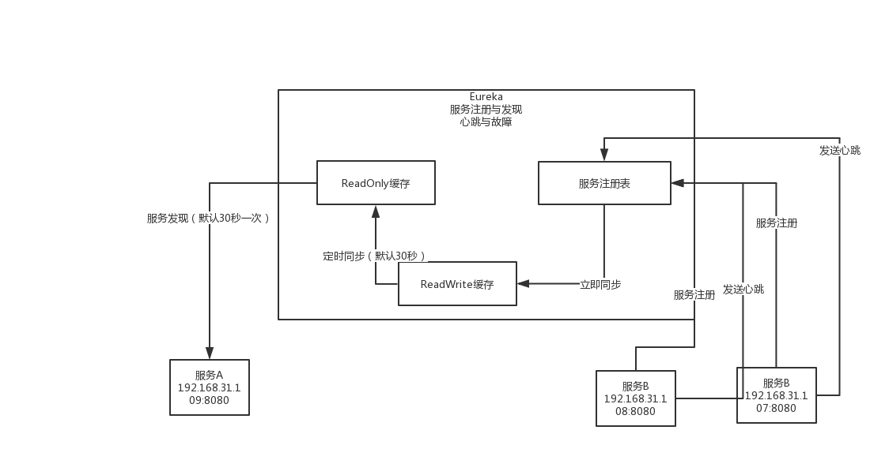

# 架构原理

## 基础架构

### 调用逻辑

> **服务注册：**当系统启动的时候会向注册中心注册自己
>
> **服务发现：**从注册中心获取可用服务地址及端口等信息
>
> **负载均衡：**当同一个服务存在多份时需要通过`Ribbon`组件进行负载均衡
>
> **服务调用：**`Feign`负责调用相应的系统
>
> **协议：**`SpringCloud`通过`http协议`

## 注册中心

### 基础架构

> 服务注册中心主要提供**服务注册与发现**和**心跳与故障**
>
> 当系统启动时向注册中心注册自己，注册中心维护一个`服务注册表`，此时服务注册表会立即将数据同步到`ReadWrite缓存`中，`ReadWrite缓存`将定时把数据与`ReadOnly缓存`进行同步。当注册中心发现某个服务已宕机后，会将其从`服务注册表`中删除，并且同时删除`ReadWrite缓存`，再定时将数据同步到`ReadOnly缓存`中，服务调用方使用`ReadOnly缓存`中的服务提供者信息进行调用