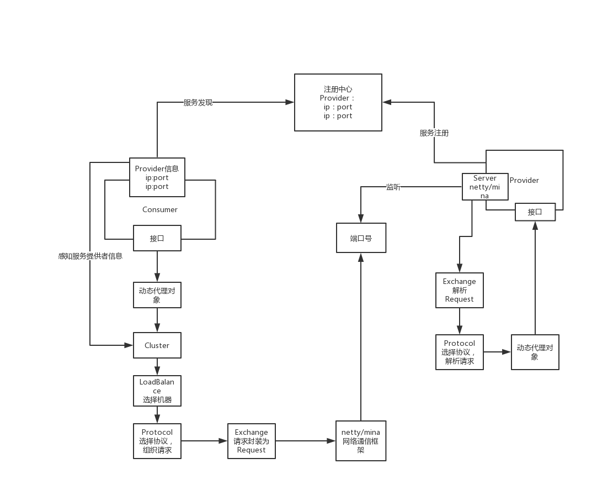
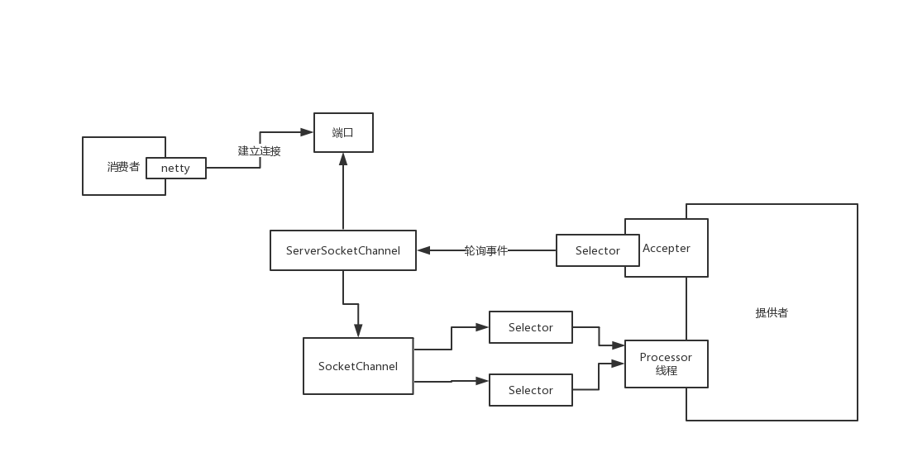

# 架构原理

## 基础架构

### 调用逻辑

> **服务注册：**在提供者启动时向注册中心注册自己，即将自己的ip地址及端口号告诉注册中心，注册中心记录下该提供者的信息
>
> **服务发现：**当消费者启动时向注册中心获取服务提供者的信息
>
> **动态代理对象：**在代码中我们只是调用了一个接口，并没有实现类，那么是如何调用远程的呢？其实是`Dubbo`为我们的接口生成了代理对象，使用代理对象来进行通信
>
> **负载均衡：**即图中`Cluster`和`LoadBalance`，当同一个服务有多个提供者时，需要通过负载均衡策略从而得知需要访问哪个服务
>
> **选择协议：**选择使用什么协议进行通信，dubbo、rmi、hessian、http、webservice、thrift、memcached、redis、rest
>
> **封装请求：**将请求信息，参数信息等进行封装
>
> **网络通信：**`Dubbo`底层通过`Netty`进行网络通信

## 通信原理

### 通信逻辑

> `Netty`在网络通信时使用了`NIO`进行通信
>
> 消费者与提供者通过`ServerSocketChannel`建立连接，然后为每一个连接创建一个`SocketChannel`
>
> 提供者的`Accepter`线程通过`Selector`轮询`ServerSocketChannel`中的事件
>
> 如果监听到某个消费者发送了消息，`Accepter`会将该消息交给给对应的`SocketChannel`，同时每一个`Selecter`会通过轮询`SocketChannel`看有没有事件发生，如果有就分配线程进行处理